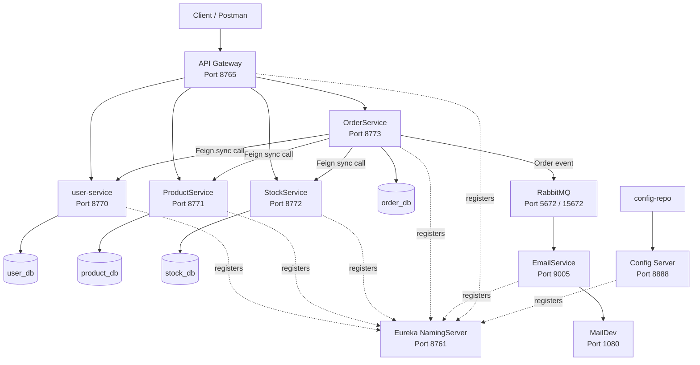

# SportifyShop Microservices System

---

## 1. Technology Stack

The system is built using modern technologies for developing distributed microservice-based applications.

| Category                  | Technology                                                                   |
| ------------------------- | ---------------------------------------------------------------------------- |
| **Backend**               | Java 17, Spring Boot                                                         |
| **Microservices Support** | Spring Cloud, Netflix Eureka, Spring Cloud Gateway, Config Server, OpenFeign |
| **Database**              | PostgreSQL                                                                   |
| **Messaging**             | RabbitMQ                                                                     |
| **Email Testing**         | MailDev                                                                      |
| **Testing**               | JUnit 5, Mockito, Spring Boot Test, MockMvc                                  |
| **Containerization**      | Docker, Docker Compose                                                       |
| **CI/CD**                 | GitHub Actions, DockerHub                                                    |
| **Build Tool**            | Maven                                                                        |

> **Database-per-service approach:** Business microservices use separated PostgreSQL databases. This improves loose coupling between services and allows each service to manage its own data independently.

---

## 2. Project Description & Business Logic

SportifyShop is a distributed microservices system for managing an online sports equipment shop. The system supports user management, product management, stock management, order processing and asynchronous email notifications.

The project was developed as a microservice-based distributed information system using Spring Boot and Spring Cloud. Each business responsibility is separated into its own microservice, while infrastructural components such as Eureka, Config Server and API Gateway provide service discovery, centralized configuration and routing.

### Core Business Logic

The main business flow of the system is based on the following process:

1. An administrator manages users, products and stock.
2. Products are stored in the product catalog.
3. Stock records define the available quantity for each product.
4. A user creates an order through the API Gateway.
5. OrderService validates the user, product and stock availability by using synchronous Feign communication with other microservices.
6. If the order is valid, the order is saved and the stock quantity is reduced.
7. After the order is successfully created, OrderService publishes an event to RabbitMQ.
8. EmailService consumes the event and sends an email notification to the user through MailDev.

This separation of responsibilities allows the system to be easier to maintain, test and extend.

---

## 3. Microservices and Infrastructure Components

### NamingServer

NamingServer is a Netflix Eureka service registry. All microservices register themselves with Eureka so that they can be discovered by other services. This removes the need for hardcoded direct service addresses between business services.

### config-server

Config Server provides centralized configuration management. Service configuration files are stored in the `config-repo` folder and are loaded by microservices during startup.

### ApiGateway

ApiGateway is the single entry point into the system. Client requests are sent to the gateway, and the gateway forwards them to the appropriate microservice. It also contains authentication and authorization logic based on user roles.

### user-service

User-service is responsible for user management. It supports creating users and administrators, retrieving users, updating user data and deleting users. It is also used by the API Gateway for authentication and by OrderService for validating the user during order creation.

### ProductService

ProductService is responsible for managing sports equipment products. It supports creating, retrieving, updating and deleting products. Other services use it to check whether a product exists and to retrieve product information.

### StockService

StockService is responsible for managing stock quantities. It stores and updates the available quantity for each product. During order creation, OrderService communicates with StockService to check and reduce stock.

### OrderService

OrderService is responsible for order processing. It communicates with user-service, ProductService and StockService using Feign clients. After a valid order is created, it publishes an event to RabbitMQ so that EmailService can send an order confirmation email.

### EmailService

EmailService is responsible for sending email notifications. It listens to RabbitMQ messages and sends emails using JavaMailSender. In the local environment, emails are captured and displayed through MailDev.

### Shared Modules

The project also contains two shared modules:

| Module           | Purpose                                                     |
| ---------------- | ----------------------------------------------------------- |
| `Util`           | Common exceptions and global exception handling             |
| `ServiceLibrary` | DTO classes, service interfaces and Feign proxy definitions |

These modules are installed before building other services because the business microservices depend on them.

---

## 4. Microservices Architecture

### System Flow

1. **Client** sends a request to **API Gateway** on port `8765`.
2. **API Gateway** handles routing and security.
3. **Eureka NamingServer** provides service discovery.
4. **Config Server** provides centralized configuration.
5. **OrderService** synchronously communicates with user-service, ProductService and StockService using Feign clients.
6. **OrderService** asynchronously publishes an order event to RabbitMQ.
7. **EmailService** consumes the event and sends an email notification through MailDev.

### Architecture Diagram



---

## 5. Communication Between Microservices

The system supports both synchronous and asynchronous communication.

### Synchronous Communication

Synchronous communication is implemented using OpenFeign clients. OrderService uses Feign clients to communicate with other microservices during order creation.

Examples of synchronous communication:

| Source Service | Target Service | Purpose                          |
| -------------- | -------------- | -------------------------------- |
| OrderService   | user-service   | Validate user by email           |
| OrderService   | ProductService | Validate product by product code |
| OrderService   | StockService   | Check and update stock quantity  |

This type of communication is used when a service needs an immediate response before continuing the business process.

### Asynchronous Communication

Asynchronous communication is implemented using RabbitMQ. After an order is successfully created, OrderService publishes an event to RabbitMQ. EmailService consumes the event and sends an email notification to the user.

This makes order creation independent from email sending. Even if email processing is slower, the order can still be created successfully.

---

## 6. Messaging Schema - RabbitMQ

RabbitMQ is used for asynchronous communication between OrderService and EmailService.

| Property        | Value                                   |
| --------------- | --------------------------------------- |
| **Exchange**    | `order_exchange`                        |
| **Queue**       | `email_queue`                           |
| **Routing Key** | `order_routing_key`                     |
| **Producer**    | OrderService                            |
| **Consumer**    | EmailService                            |
| **Purpose**     | Sending order confirmation email events |

The message is published after successful order creation. EmailService listens to the queue and sends an email notification through MailDev.

---

## 7. API Documentation

> **Important:** All requests should be sent through the API Gateway at `http://localhost:8765`.

### 7.1 User Service

| Endpoint                    | Method   | Access                | Description             |
| --------------------------- | -------- | --------------------- | ----------------------- |
| `/users`                    | `GET`    | `ADMIN`               | Get all users           |
| `/user/id?id={id}`          | `GET`    | `ADMIN`               | Get user by ID          |
| `/user/email?email={email}` | `GET`    |  Internal use | Get user by email       |
| `/user/newUser`             | `POST`   | `ADMIN`               | Create a regular user   |
| `/user/newAdmin`            | `POST`   | `ADMIN`               | Create an administrator |
| `/user`                     | `PUT`    | `ADMIN`               | Update user data        |
| `/user?id={id}`             | `DELETE` | `ADMIN`               | Delete user             |

### 7.2 Product Service

| Endpoint                                  | Method   | Access          | Description                 |
| ----------------------------------------- | -------- | --------------- | --------------------------- |
| `/products`                               | `GET`    | `ADMIN`, `USER` | Get all products            |
| `/product/id?id={id}`                     | `GET`    | `ADMIN`, `USER` | Get product by ID           |
| `/product/code?productCode={productCode}` | `GET`    | `ADMIN`, `USER` | Get product by product code |
| `/product`                                | `POST`   | `ADMIN`         | Create a new product        |
| `/product`                                | `PUT`    | `ADMIN`         | Update product              |
| `/product?id={id}`                        | `DELETE` | `ADMIN`         | Delete product              |

### 7.3 Stock Service

| Endpoint                           | Method   | Access                               | Description               |
| ---------------------------------- | -------- | ------------------------------------ | ------------------------- |
| `/stocks`                          | `GET`    | `ADMIN`                              | Get all stock records     |
| `/stock?productCode={productCode}` | `GET`    | `ADMIN`                              | Get stock by product code |
| `/stock`                           | `POST`   | `ADMIN`                              | Create stock record       |
| `/stock?fromOrder={true/false}`    | `PUT`    | `ADMIN` / internal OrderService call | Update stock quantity     |
| `/stock?productCode={productCode}` | `DELETE` | `ADMIN`                              | Delete stock record       |

### 7.4 Order Service

| Endpoint         | Method   | Access          | Description                                 |
| ---------------- | -------- | --------------- | ------------------------------------------- |
| `/orders`        | `GET`    | `ADMIN`         | Get all orders                              |
| `/order/email`   | `GET`    | `ADMIN`, `USER` | Get orders for currently authenticated user |
| `/order`         | `POST`   | `ADMIN`, `USER` | Create a new order                          |
| `/order`         | `PUT`    | `ADMIN`         | Update order                                |
| `/order?id={id}` | `DELETE` | `ADMIN`         | Delete order                                |

---

## 8. Deployment Guide

### Prerequisites

To run the system locally, Docker Desktop must be installed.

Java, Maven, PostgreSQL, RabbitMQ and MailDev do not need to be installed manually for local execution because the system is containerized.

### Startup Procedure

Run the following command from the project root folder:

```bash
docker compose up -d --build
```

This command builds Docker images and starts all containers in the background.

### Check Running Containers

```bash
docker compose ps
```

### View Logs

```bash
docker compose logs -f
```

To view logs for a specific service:

```bash
docker compose logs -f user-service
```

### Stop the System

```bash
docker compose down
```

### Stop the System and Remove Volumes

```bash
docker compose down -v
```

This also removes database data stored in Docker volumes.

---

## 9. Container Startup Order

Docker Compose manages the startup of the system components.

The expected startup flow is:

1. PostgreSQL, RabbitMQ and MailDev start first.
2. NamingServer starts and becomes available.
3. Config Server starts and loads configuration from `config-repo`.
4. Business microservices start and register with Eureka.
5. API Gateway starts and becomes the main entry point into the system.

This order ensures that services are available before dependent components try to use them.

---

## 10. Useful Ports and URLs

| Component           | URL / Port               | Purpose                    |
| ------------------- | ------------------------ | -------------------------- |
| API Gateway         | `http://localhost:8765`  | Main entry point           |
| Eureka NamingServer | `http://localhost:8761`  | Service registry dashboard |
| Config Server       | `http://localhost:8888`  | Centralized configuration  |
| RabbitMQ Management | `http://localhost:15672` | RabbitMQ dashboard         |
| MailDev             | `http://localhost:1080`  | Email inbox                |
| PostgreSQL          | `localhost:5432`         | Database                   |

RabbitMQ credentials:

```text
username: guest
password: guest
```

Initial administrator account:

```text
email: admin@gmail.com
password: admin
```

---

## 11. CI/CD Pipeline

The project uses GitHub Actions for CI/CD. The pipeline is defined in:

```text
.github/workflows/ci-cd.yml
```

The pipeline is automatically triggered on:

* push to `main`
* push to `develop`
* pull request to `main`
* pull request to `develop`

### Pipeline Overview

```text
Push / Pull Request
        |
        v
Checkout source code
        |
        v
Set up Java 17
        |
        v
Install Util and ServiceLibrary
        |
        v
Run unit and integration tests
        |
        v
Package services into JAR files
        |
        v
Build Docker images
        |
        v
If branch is main: push Docker images to DockerHub
```

### Build Phase

In the build phase, GitHub Actions prepares the Java 17 environment and installs shared modules:

* `Util`
* `ServiceLibrary`

These modules must be installed first because the microservices use them as Maven dependencies.

After that, all services are packaged into executable `.jar` files.

### Test Phase

In the test phase, unit and integration tests are executed for the five business microservices:

* user-service
* ProductService
* StockService
* OrderService
* EmailService

If any test fails, the pipeline stops and the commit is marked as failed.

### Deploy Phase

In the deploy phase, Docker images are built for all runnable services. When the pipeline runs on the `main` branch, it also logs in to DockerHub and pushes the images.

DockerHub authentication is configured through GitHub repository secrets:

| Secret               | Description            |
| -------------------- | ---------------------- |
| `DOCKERHUB_USERNAME` | DockerHub username     |
| `DOCKERHUB_TOKEN`    | DockerHub access token |

The deploy phase publishes the following images:

| Docker Image                      | Service        |
| --------------------------------- | -------------- |
| `sportify-naming-server:latest`   | NamingServer   |
| `sportify-config-server:latest`   | config-server  |
| `sportify-api-gateway:latest`     | ApiGateway     |
| `sportify-user-service:latest`    | user-service   |
| `sportify-product-service:latest` | ProductService |
| `sportify-stock-service:latest`   | StockService   |
| `sportify-order-service:latest`   | OrderService   |
| `sportify-email-service:latest`   | EmailService   |

### Branch Strategy

| Branch / Event | Build | Test | Docker Build | DockerHub Push |
| -------------- | ----- | ---- | ------------ | -------------- |
| `develop` push | Yes   | Yes  | Yes          | No             |
| `main` push    | Yes   | Yes  | Yes          | Yes            |
| Pull request   | Yes   | Yes  | Yes          | No             |

This means that `develop` and pull requests are used for validation, while `main` represents a stable state that publishes Docker images.

---

## 12. DockerHub and Deployment Explanation

For local development, Docker Compose builds images directly from the local source code using the `build` sections inside `docker-compose.yaml`.

For deployment, the CI/CD pipeline publishes Docker images to DockerHub. These images can be pulled and started in another environment using Docker Compose without rebuilding the source code manually.

* **Build:** Maven builds and packages the services.
* **Test:** Unit and integration tests are executed.
* **Deploy:** Docker images are pushed to DockerHub and prepared for execution in another environment.

---

## 13. App Testing Guide

The application can be tested through API Gateway using Postman or another API client.

Base URL:

```text
http://localhost:8765
```

### Preconfigured Admin

```text
email: admin@gmail.com
password: admin
role: ADMIN
```

### Example DTO Request Bodies

The following examples can be used for testing the application through API Gateway with Postman or another API client.


#### UserDto example

Used for creating a regular user or administrator.

Endpoint examples:

```text
POST http://localhost:8765/user/newUser
POST http://localhost:8765/user/newAdmin
```

Request body:

```json
{
  "firstName": "User",
  "lastName": "User",
  "email": "user@gmail.com",
  "password": "user"
}
```

The `role` field is assigned by the service. When calling `/user/newUser`, the role is set to `USER`. When calling `/user/newAdmin`, the role is set to `ADMIN`.


#### ProductDto example

Used for creating or updating a product.

Endpoint examples:

```text
POST http://localhost:8765/product
PUT http://localhost:8765/product
```

Request body:

```json
{
  "name": "Basketball Ball",
  "description": "Official size 7 basketball ball",
  "productCode": "BALL-001",
  "price": 3500.00
}
```

The `productCode` field is used as a unique product identifier and is later used by StockService and OrderService.


#### StockDto example

Used for creating or updating stock for a product.

Endpoint examples:

```text
POST http://localhost:8765/stock
PUT http://localhost:8765/stock
```

Request body:

```json
{
  "productCode": "BALL-001",
  "quantity": 50
}
```

This means that product `BALL-001` has 50 available units in stock.


#### OrderDto example

Used for creating an order.

Endpoint example:

```text
POST http://localhost:8765/order
```

Request body:

```json
{
  "productCode": "BALL-001",
  "quantity": 2
}
```

When this request is sent, OrderService validates the authenticated user, checks the product through ProductService, checks and updates stock through StockService, saves the order and publishes an event to RabbitMQ. After that, EmailService consumes the event and sends an email notification through MailDev.

Used for updating the status of an existing order.

Endpoint example:

```text
PUT http://localhost:8765/order
```

Request body:

```json
{
  "productCode": "BALL-001",
  "status": "CONFIRMED"
}
```

This request updates the order status. The exact allowed status values depend on the order status logic implemented in OrderService.

### Example End-to-End Flow

#### Step 1 - Check Eureka

Open:

```text
http://localhost:8761
```

Verify that all services are registered.

#### Step 2 - Create or Use Admin Account

The system creates an initial admin automatically:

```text
admin@gmail.com / admin
```

Use this account for administrator operations.

#### Step 3 - Create Product

Send a request to ProductService through API Gateway to create a product.

Example endpoint:

```text
POST http://localhost:8765/product
```

#### Step 4 - Create Stock Record

Create or update stock for the product.

Example endpoint:

```text
POST http://localhost:8765/stock
```

or

```text
PUT http://localhost:8765/stock
```

#### Step 5 - Create Order

Create an order through OrderService.

Example endpoint:

```text
POST http://localhost:8765/order
```

During this process, OrderService validates user, product and stock information using synchronous Feign calls.

#### Step 6 - Verify Email Notification

Open MailDev:

```text
http://localhost:1080
```

After the order is successfully created, an email notification should be visible in the MailDev inbox.

#### Step 7 - Verify RabbitMQ

Open RabbitMQ Management:

```text
http://localhost:15672
```

Login:

```text
guest / guest
```

Check exchanges, queues and message flow.

---

## 14. Testing Strategy

The system contains unit and integration tests for the five business microservices.

### Unit Tests

Unit tests are used to test business logic in isolation. Repository dependencies and external service dependencies are mocked using Mockito.

Examples:

* user service business logic
* product service business logic
* stock service business logic
* order service business logic
* email listener logic

### Integration Tests

Integration tests verify that Spring context, controllers and related components work correctly. They use a separate `test` profile and test-specific configuration.

The tests are designed to run inside GitHub Actions without requiring manual startup of the whole Docker environment.

### Running Tests Manually

Tests can be started from each service folder:

```bash
mvn test
```

Example:

```bash
cd user-service
mvn test
```

---

## 15. Monitoring and Maintenance

The system provides several dashboards for checking the state of the distributed system.

| Tool                | URL                      | Credentials     | Purpose                              |
| ------------------- | ------------------------ | --------------- | ------------------------------------ |
| Eureka Dashboard    | `http://localhost:8761`  | -               | Shows registered services            |
| RabbitMQ Management | `http://localhost:15672` | `guest / guest` | Shows queues, exchanges and messages |
| MailDev UI          | `http://localhost:1080`  | -               | Shows outgoing emails                |
| Docker Compose      | CLI                      | -               | Shows container state and logs       |

Useful Docker commands:

```bash
docker compose ps
```

```bash
docker compose logs -f
```

```bash
docker compose restart user-service
```

```bash
docker compose down
```

---

## 16. Conclusion

SportifyShop demonstrates the core principles of distributed information systems and microservice architecture. The system contains service discovery, centralized configuration, API Gateway routing, five business microservices, synchronous communication with OpenFeign, asynchronous messaging with RabbitMQ, PostgreSQL databases, Docker containerization, unit and integration tests, and a GitHub Actions CI/CD pipeline with DockerHub deployment.